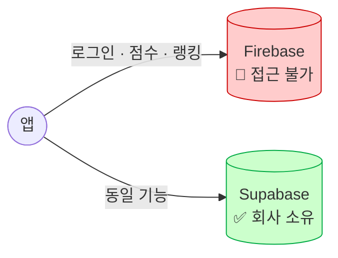
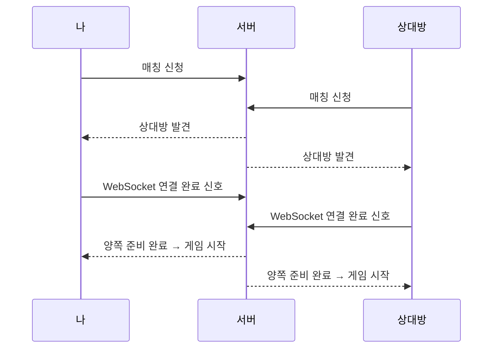
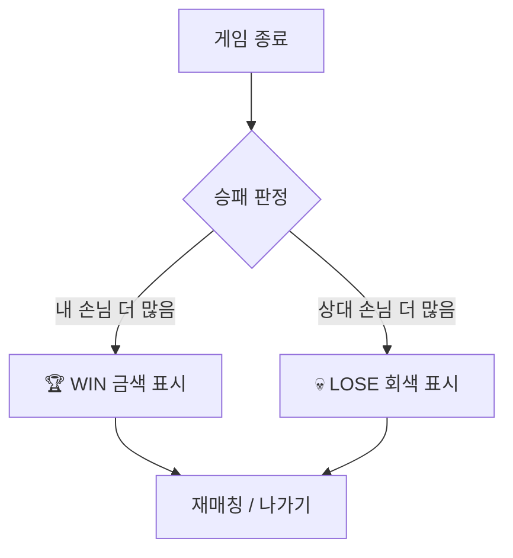
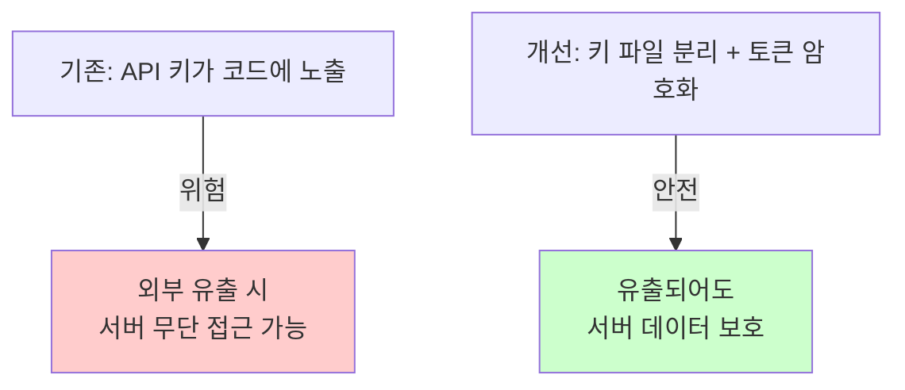

# 렉스버거 개발 보고서

> 📅 보고 기간: 2026년 3월 ~ 4월  
> 담당: 개발팀

---

## 1. 서버 인프라 전환 — Firebase → Supabase

**기간:** 2026년 3월 초 ~ 3월 말

4년 전 퇴사한 직원 계정으로 묶여 접근이 불가능했던 Firebase 서버를, 회사 소유의 Supabase 서버로 전면 교체했습니다. 유저 화면 변화는 없으며, Google/게스트 로그인은 그대로 유지됩니다.



| 항목 | 이전 | 이후 |
|------|------|------|
| 서버 소유권 | 퇴사자 개인 계정 | 회사 Supabase 계정 |
| 로그인 | Firebase Auth | Supabase Auth (Google 유지) |
| 데이터베이스 | Firebase Firestore | PostgreSQL (Supabase) |
| 코드 내 SDK | Firebase SDK 전량 포함 | 완전 제거, REST API 방식 |

---

## 2. 랭킹 & 내 점수 시스템 완성

**기간:** 2026년 3월 중순 ~ 3월 말

서버 전환 이후 발견된 점수·랭킹 버그를 수정하고 화면을 완성했습니다.


**수정된 버그**

| 버그 | 증상 | 결과 |
|------|------|------|
| 점수 중복 기록 | 같은 점수 재획득 시 2번 저장 | ✅ 수정 |
| 0점 유저 랭킹 노출 | 미플레이 유저가 순위에 표시 | ✅ 수정 |
| 내 점수 빈 슬롯에 0점 표시 | 미플레이 슬롯에 "0"이 보임 | ✅ 수정 |
| 내 순위 2중 표시 | 리스트 + 고정 박스에 중복 노출 | ✅ 수정 |

**완성된 화면 구조**

```
┌─────────────────────────┐
│  RANKING                │
│  ┌──┬──────────┬──────┐ │
│  │ 1│ Player A │ 980  │ │
│  │ 2│ Player B │ 870  │ │
│  │ 3│ 나       │ 750  │ │  ← 리스트 내 내 항목
│  └──┴──────────┴──────┘ │
│  ──────────────────────  │
│  │ 3│ 나       │ 750  │  ← 하단 고정 (항상 표시)
└─────────────────────────┘
```

---

## 3. 경쟁 모드 신규 개발 (1:1 실시간 대결)

**기간:** 2026년 4월 초 ~ 4월 중순

두 플레이어가 같은 햄버거를 조립하는 속도 경쟁. 더 빠르게 맞힐수록 손님이 내 가게로 이동하는 **"손님 쟁탈전"** 방식으로 구현했습니다.


### 매칭 흐름



> 💡 양쪽이 모두 준비됐을 때만 동시에 시작하도록 **2-Phase Handshake** 방식을 적용했습니다. 한 쪽이 먼저 시작하는 불공평 문제를 원천 차단합니다.

### 게임 화면 구조

```
[내 가게 🏪] ◀──── 손님 🧑 ────▶ [상대 가게 🏪]
    12명                               8명
━━━━━━━━━━━━━━━━━━━━━━━━━━━━━━━━━━━━━━━━
  내가 이길수록 손님이 왼쪽(내 가게)으로 이동
```


### 결과 화면




### 해결한 주요 문제

| 문제 | 원인 | 해결 |
|------|------|------|
| 한 쪽만 게임 시작 | 네트워크 속도 차이로 선발 시작 | 양쪽 준비 확인 후 동시 시작 |
| 결과화면 미표시 (Android) | 점수 데이터 설정 코드 누락 | 분기 코드 추가 |
| 재매칭 팝업 안 뜸 | UI 오브젝트 위치 오배치 (z축) | 팝업 표시 시 위치 자동 교정 |
| 재연결 후 무한 대기 | 재연결 전 발생한 이벤트 유실 | 재연결 후 DB 직접 조회로 복구 |

**✅ Android 실기기 테스트 통과 (2026-04-14)**

---

## 4. 보안 강화

**기간:** 2026년 4월 초



| 항목 | 내용 |
|------|------|
| API 키 분리 | 서버 접속 키를 코드 외부 파일로 분리 |
| 인증 토큰 암호화 | 로그인 유지 토큰을 기기에 암호화 저장 |
| DB 접근 권한(RLS) | 유저 본인 데이터만 읽기·쓰기 가능 |

---

## 5. 유지보수 & 안정성

**기간:** 2026년 3월 ~ 4월 (전 기간)

- **Android 빌드 환경 재구성** — Unity 내장 빌드 도구로 통일, 이후 빌드 안정화
- **스태미나 null 오류 수정** — 경쟁 모드 → 로비 복귀 시 발생하던 앱 오류 수정
- **개발/배포 빌드 분리** — 개발 테스트 시 스태미나 무제한 (배포 빌드 미적용)
- **SQL 스키마 파일 보관** — `Assets/Editor/battle_schema.sql` 별도 관리

---

## 잔여 작업

| 항목 | 우선순위 | 비고 |
|------|---------|------|
| 경쟁 모드 DB 컬럼 추가 | 🔴 높음 | Supabase 대시보드 SQL 1회 실행 |
| iOS 빌드 & Apple 로그인 | 🔴 높음 | App Store 배포 전 필요 |
| 타이머 아이콘 크기 오류 | 🟡 보통 | 경쟁 모드 타이머 아이콘 비정상 크기 |
| 게이지 배경 바 미이동 | 🟢 낮음 | 게임 플레이에 영향 없음 |
